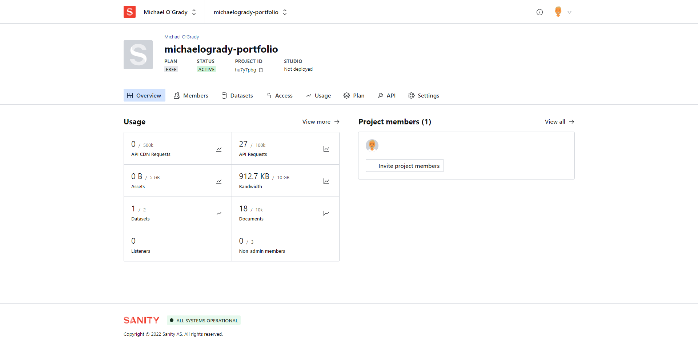

# JamStack Portfolio in React 17

> JamStack Portfolio is a single page portfolio website using Sanity as a content management system (backend) with a react frontend.

<h1 align="center">

</h1>

- [View Live Site](http://jamstack-portfolio-in-react-17.vercel.app/)

# Table of Contents

- [JamStack Portfolio in React 17](#jamstack-portfolio-in-react-17)
- [Table of Contents](#table-of-contents)
- [Advantages](#advantages)
- [Packages & Features](#packages--features)
- [Project Details](#project-details)
- [Instructions](#instructions)
- [Starting your own project](#starting-your-own-project)
  - [Sanity ("backend database")](#sanity-backend-database)
  - [Frontend](#frontend)
  - [Deployment](#deployment)
  - [Packages](#packages)
  - [Sanity Studio](#sanity-studio)
  - [Developer experience](#developer-experience)
  - [Structured Content](#structured-content)
- [Updating content](#updating-content)
- [Project Images](#project-images)

# Advantages

- [x] Huge time saving advantage over node, express, mongodb

# Packages & Features

- framer-motion — [React Animations](https://www.framer.com/docs/examples/)
- [node-sass](https://www.npmjs.com/package/node-sass)
- [react-icons](https://www.npmjs.com/package/react-icons)

# Project Details

- JamStack stands for **J**avaScript, **A**PI & **M**arkup. The JamStack portfolio is API Driven, with data stored on Sanity servers and served to the website.
- Website content is controlled via your user admin panel `https://www.sanity.io/manage`
- [See JamStack.org ](https://jamstack.org/headless-cms/sanity/)
- [Sanity](https://www.sanity.io/)

# Instructions

- Run `npm start` to start the frontend react application
- Run `sanity start` inside

# Starting your own project

## Sanity ("backend database")

- Ensure sanity/cli is installed `npm i -g @sanity/cli`
- Create `backend_sanity` directory to hold your backend
  - Run `sanity init` inside `backend_sanity` directory to initialize a new Sanity project
    - Create a free Account on [Sanity](https://www.sanity.io/)
    - Log into Sanity via the terminal options on-screen
    - Assign project name
    - Use default datased configuration
    - Use the existing project output path
    - Choose `Clean project with no predefined schemas`
    - Run `sanity docs` to open documentation in a browser
    - Run `sanity start` to run the backend (**Content Studio**)
  - Create schemas for your data objects in `backend_sanity_portfolio\schemas`
  - Import the schemas & types into `schema.js`
  - You will now see the schema within the **Content Studio**
    - Add your data to the schema within the **Content Studio** admin panel
  - Complete

## Frontend

- Create your frontend React application `npx create-react-app frontend_react`
- Install Required Dependencies (used within this application) `npm i @sanity/client @sanity/image-url framer-motion node-sass react-icons`
- Implement your file/folder structure: create the following folders inside the src
  - `components`
    - Create the folder for your pages here: i.e. `About/` with `About.jsx` & `About.scss` files
    - `About/About.js`
  - `assets`
  - `constants`
  - `container`
- Continue building out your App
- Create a `.env` file in the root directory of the React app with the following relating to your project:

```
REACT_APP_SANITY_PROJECT_ID=<REACT_APP_SANITY_PROJECT_ID_goes_here>
REACT_APP_SANITY_TOKEN=<REACT_APP_SANITY_TOKEN_goes_here>
dataset=<dataset_goes_here>
apiVersion=<apiVersion_goes_here>
```

## Deployment

- Inside the React project, run `npm run build` to build the optimized production build
- Deploy on Netlify, drag the build folder on the sites page, or connect your github repo
- Alternatively deploy on vercel by deploying the repo
- **Do not forget to go to [https://www.sanity.io/manage/](https://www.sanity.io/manage/)** to add the final deploy URL to CORS origins (Hosts that can connect to the project API.) otherwise your data will not come through and you'll get those nasty CORS Errors.

## Packages

```bash
├── @sanity/base@2.30.1
├── @sanity/core@2.30.2
├── @sanity/default-layout@2.30.1
├── @sanity/default-login@2.30.1
├── @sanity/desk-tool@2.30.1
├── @sanity/eslint-config-studio@2.0.0
├── @sanity/vision@2.30.1
├── eslint@8.20.0
├── prop-types@15.8.1
├── react-dom@17.0.2
├── react@17.0.2
└── styled-components@5.3.5
```

## Sanity Studio

Sanity Studio is an open source headless real-time CMS, that you can customize with JavaScript and React.

- Efficient editing, instant UI for complex fields
- Responsive, works on small screens
- Plug-in architecture and custom input components
- Style with your own branding
- Advanced block editor for structured content
- Use JavaScript to add field validations, organize documents, and set initial values

## Developer experience

- Bring your own frontend, or whatever else you might need:Vue, Svelte, Node, .NET, PHP, Golang, or whatever speaks HTTP
- Sweet APIs for reading, writing, importing, exporting, go back in time, and listening for updates
- Secure, scalable and GDPR compliant
- Zero config Graph Oriented Query Language (GROQ), and GraphQL API
- Helpful and friendly developer community
- Build the CMS solution you need:React CMS, eCommerce CMS, Gatsby CMS, Jamstack CMS, Mobile CMS

## Structured Content

- Distribute from a single source of thruth, in real-time
- Unlock programmatic approaches to workflows and design
- Upload images and transform them on demand, and integrate with any digital asset manager
- Customizable previews
- Query images for metadata like dominant colors, sizes, geo-location, and EXIF metadata
- See how rich text that can be serialized into any markup language, and learn about the Sanity Rich Text Editor

# Updating content

The backend (Sanity Studio) can can be hosted on Vercel (for example) you can log into your application there and update the content remotely.

- Alternatively, clone the project
  - `cd backend_sanity_portfolio`
  - `sanity start` to run the backend Sanity Studio application, login and update your content there.

# Project Images

<h1 align="center">




</h1>
